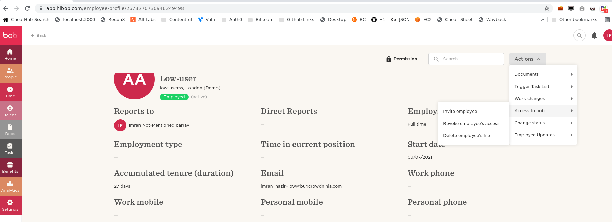

## How to Add and Invite an New User in HiBOB

- Login to your Hibob Admin Account on https://app.hibob.com
- Go to https://app.stage.hibob.com/people/directory and click on New Hire + button

- Fillup all the necessary information till you reach_invite_ tab and click Done button to invite him.

- Now to invite the that user to Hibob you may need to go to his profile into people section in sidebar and Click on invite Employee

- Now the invited Employee will be sent an invitation email from hibob, Accept the invitation and Join the Dashboard via https://app.hibob.com.

